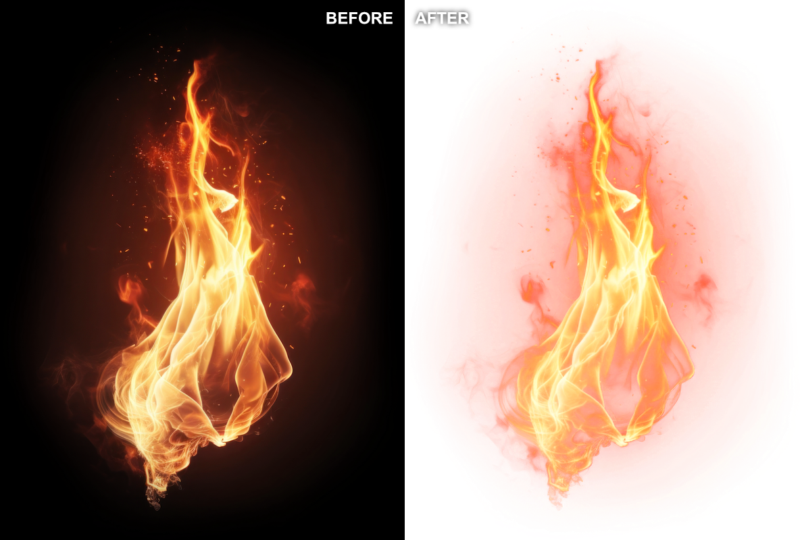

# bgone

Ultra-fast CLI tool for removing solid background colors from images using color unmixing.



## Features

- **Blazing fast** - Written in Rust with parallel processing
- **Background color detection** - Auto-detects the background color from the edges of the image if not specified
- **Multiple foreground colors** - Handles images with multiple foreground colors (including gradients, glows, shadows, etc.) mixed with the background (due to anti-aliasing or translucency in the image)
- **Foreground color deduction** - Can automatically deduce unknown foreground colors using the `auto` keyword
- **Flexible modes** - Strict mode for exact color matching, or non-strict mode for more natural transparency
- **Opacity optimization** - Intelligently optimizes opacity based on mode and colors
- **Precise color unmixing** - Uses least-squares optimization for accurate color separation

## Installation

### Using Homebrew (macOS/Linux)

```bash
brew tap benface/bgone
brew install bgone
```

### Using Cargo

```bash
cargo install bgone
```

## Usage

### Non-Strict Mode (Default)

In non-strict mode, bgone can use any color needed to perfectly reconstruct the image while making the background transparent.

```bash
# Fully automatic - detects the background and removes it
# Output defaults to input-bgone.png (or input-bgone-1.png if that exists, etc.)
bgone input.png

# Specify output path
bgone input.png output.png

# With background color - overrides automatic detection
bgone input.png output.png --bg=#ffffff

# With foreground color - optimizes for high opacity when pixels match this color (within a threshold)
bgone input.png --fg=#ff0000

# Multiple foreground colors - output pixels can be any mix of these colors
bgone input.png --fg ff0000 00ff00 0000ff

# Foreground color deduction - uses a known amount of unknown colors
bgone input.png --fg auto
bgone input.png --fg auto auto --bg ffffff

# Mix known and unknown colors
bgone input.png --fg ff0000 auto

# Using shorthand notation
bgone input.png -f f00 -b fff
bgone input.png -f auto -s
bgone input.png -f f00 0f0 00f -b fff -t 0.1
```

### Strict Mode

Strict mode restricts unmixing to only the specified foreground colors, ensuring exact color matching.

```bash
# Strict mode requires --fg, but supports both known and unknown colors
bgone input.png --strict --fg=#ff0000
bgone input.png --strict --fg auto
bgone input.png --strict --fg ff0000 auto

# With specific background color
bgone input.png --strict --fg=#f00 --bg=#fff
```

### Additional Examples

```bash
# Multiple colors with # prefix still works, but requires quotes in shell
bgone input.png --fg "#f00" "#0f0" "#00f"

# Mix of shorthand and full notation
bgone input.png --fg ff0000 0f0 00f --bg fff
```

## CLI Options

- `input` - Path to the input image
  - Supports many formats: PNG, JPEG, WebP, TIFF, GIF, BMP, ICO, and more
- `output` - (Optional) Path for the output image
  - If not specified, automatically generates filename with `-bgone` suffix
  - Output format is determined by file extension
  - For formats without alpha support (JPEG, BMP, etc.), automatically converts to PNG
  - For formats with alpha support (PNG, WebP, TIFF, GIF), preserves the format
- `-f, --fg COLOR...` - Foreground colors in hex format (e.g., `f00`, `ff0000`, `#ff0000`) or `auto` to deduce unknown colors
  - Optional in non-strict mode
  - Required in strict mode
- `-b, --bg COLOR` - Background color in hex format
  - If not specified, automatically detects the background color
- `-s, --strict` - Enable strict mode (requires `--fg` and restricts to specified colors only)
- `-t, --threshold FLOAT` - Color similarity threshold (`0.0`-`1.0`, default: `0.05`)
  - When using one or multiple `auto` foreground colors: colors within this threshold are considered similar during deduction
  - When using any `--fg` in non-strict mode: pixels within this threshold of a (known or deduced) foreground color will use that color
- `-h, --help` - Print help information
- `-v, --version` - Print version information

## Supported Formats

### Input Formats
bgone can read images in many formats, including:
- PNG, JPEG, GIF, WebP, TIFF, BMP, ICO, TGA, DDS, HDR, OpenEXR, QOI, and more

### Output Formats
The output format is determined by the file extension:

**Formats with alpha channel support** (preserved):
- **PNG** - Recommended for most use cases
- **WebP** - Modern format with good compression
- **TIFF/TIF** - Professional/archival use
- **GIF** - For animations (though bgone only processes single frames)
- **QOI** - Fast, lossless format
- **OpenEXR** - HDR images

**Formats without alpha support** (automatically converted to PNG):
- **JPEG/JPG** - No transparency support → outputs as PNG
- **BMP** - No transparency support → outputs as PNG
- All other formats without alpha → outputs as PNG

### Examples
```bash
# JPEG input → PNG output (with transparency)
bgone photo.jpg  # Creates photo-bgone.png

# PNG input → PNG output
bgone logo.png  # Creates logo-bgone.png

# WebP input → WebP output
bgone image.webp  # Creates image-bgone.webp

# Explicit format control
bgone photo.jpg output.webp  # Force WebP output
```

## How it works

The tool uses a color unmixing algorithm to determine how much of each foreground color and the background color contributed to each pixel. It then reconstructs the image with proper alpha transparency.

### Non-Strict Mode (Default)

- **Without foreground colors**: Finds the optimal color and transparency for each pixel to perfectly reconstruct the image. Uses the maximum transparency (minimum opacity) possible for each pixel.
- **With foreground colors**:
  - Pixels within the threshold distance (default: 5%) of specified foreground colors use those colors with high opacity
  - Other pixels (like glows, shadows, or gradients) can use ANY color needed for perfect reconstruction
  - Always prioritizes correctness - every pixel is perfectly reconstructed

### Strict Mode

- Requires foreground colors to be specified (can be known colors or `auto`)
- Restricts unmixing to only the specified colors
- Optimizes for maximum opacity while maintaining exact color accuracy
- Best for images with known, specific foreground colors

### Foreground Color Deduction

When using the `auto` keyword, bgone:

1. Analyzes all colors in the image
2. Calculates what unmixed foreground colors could produce the observed blended colors
3. Evaluates different color combinations to find the best match
4. Optimizes for maximum opacity while preserving exact color accuracy

## Use Cases & Limitations

### When to Use bgone

- **Digital graphics**: Logos, icons, illustrations with solid backgrounds
- **UI/UX assets**: Interface elements, buttons, mockup components
- **Text and shapes**: Any content on uniform color backgrounds

### Limitations

bgone works best with:

- **Solid, uniform background colors**
- **Few foreground colors** (1 is ideal, 2-3 is good)
- **Clear distinction between foreground and background**

bgone may struggle with:

- **Similar foreground/background colors**: Depending on mode and number of foreground colors
- **Anti-aliased edges or complex transparency effects**: Results vary with complexity

bgone will struggle with:

- **Non-solid backgrounds**: Cannot handle gradients, textures, or patterns
- **Photography**: Photos rarely have truly solid backgrounds, and can have thousands of colors in the foreground
- **JPEG artifacts**: Compression artifacts interfere with clean color separation, and will be visible in the output
- **Multiple blended foreground colors**: Quality degrades with complex color mixing
- **Images with alpha channels**: bgone assumes fully opaque input images

### Tips for Best Results

- **Use PNG or lossless formats** for input images to avoid compression artifacts
- **Avoid JPEG input** when possible - compression artifacts will be visible in the output (though bgone will automatically convert the output to PNG)
- Manually specify the background color with `--bg` for best accuracy
- Experiment with `--threshold` for fine-tuning edge detection
- Use `auto` only for foreground colors that aren't directly visible in the image but can recreate existing colors when blended with the background
- When using `auto` with gradients or shades, pair it with white or black:
  - `--fg fff auto` for images with mostly light tones
  - `--fg 000 auto` for images with mostly dark tones

## Building

```bash
cargo build --release
```

## Running Locally

You can test the tool without installing it using `cargo run`:

```bash
cargo run --release -- input.png --fg ff0000
```

The `--` separates cargo's arguments from bgone's arguments.

## Testing

The project includes a comprehensive testing framework that validates the color unmixing algorithm by:

1. Processing test images to remove backgrounds
2. Overlaying the results back onto the original background color
3. Comparing with the original image to ensure accuracy

### Running Tests

```bash
# Run all tests
cargo test --release -- --nocapture

# Run specific test suites
cargo test --release --test strict_tests -- --nocapture
cargo test --release --test non_strict_tests -- --nocapture
cargo test --release --test color_deduction_tests -- --nocapture
cargo test --release --test square_gradient_stroke_tests -- --nocapture
cargo test --release --test translucent_recovery_tests -- --nocapture

# Generate test inputs (only needed once)
cargo test --release --test generate_inputs -- --ignored
```

### Test Results

The algorithm achieves excellent results across different test scenarios:

- **Simple cases** (solid colors): 100% similarity, infinite PSNR
- **Complex cases** (gradients, glows): 94-99% similarity, 47-65 dB PSNR
- **Color deduction**: 98-99% similarity, achieving optimal color separation

PSNR values above 40 dB indicate excellent quality reconstruction.

### Test Coverage

- **Unit tests**: Cover color parsing, normalization, background detection, color unmixing algorithm, and image overlaying
- **Integration tests**:
  - **Strict mode tests**: Solid colors, gradients, multi-color scenes, auto-detection
  - **Non-strict mode tests**: With and without foreground colors, edge cases, alpha optimization
  - **Color deduction tests**: Single/multiple unknowns, mixed known/unknown colors, gradient deduction
  - **Square gradient stroke tests**: Various threshold and mode combinations
  - **Translucent recovery tests**: Complex fire effects on different backgrounds
- **Validation approach**: Process image → overlay on background → compare with original

## Contributing

This project was entirely ✨vibe coded✨ - built with Claude Code with very little care about the actual code output. As a result, the codebase may have quirks, bugs, or unconventional patterns.

Contributions are welcome! Feel free to:

- Report bugs or suggest features through issues
- Submit PRs with improvements or optimizations
- Add more test cases
- Fix any AI-generated weirdness you find
- Share your use cases

Thank you!
