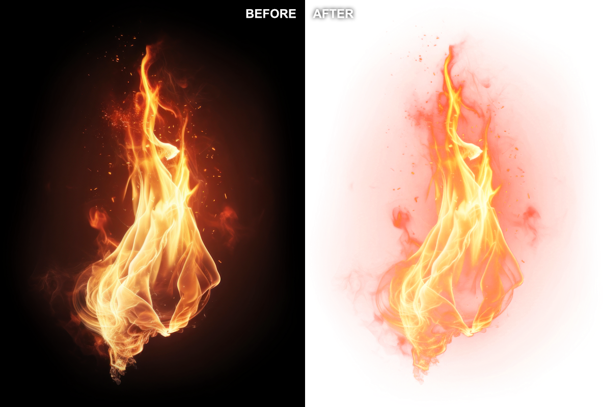

# bgone

Ultra-fast CLI tool for removing solid background colors from images using color unmixing.



## Features

- **Blazing fast** - Written in Rust with parallel processing
- **Background color detection** - Auto-detects the background color from the edges of the image if not specified
- **Multiple foreground colors** - Handles images with multiple foreground colors (including gradients, glows, shadows, etc.) mixed with the background (due to anti-aliasing or translucency in the image)
- **Foreground color deduction** - Can automatically deduce unknown foreground colors using the `auto` keyword
- **Flexible modes** - Strict mode for exact color matching, or non-strict mode for more natural transparency
- **Opacity optimization** - Intelligently optimizes opacity based on mode and colors
- **Precise color unmixing** - Uses least-squares optimization for accurate color separation
- **Batch processing** - Process many images at once via globs or multiple paths, with optional output directory

## Installation

### Using Homebrew (macOS/Linux)

```bash
brew tap benface/bgone
brew install bgone
```

### Using Cargo

```bash
cargo install bgone
```

## Usage

### Non-Strict Mode (Default)

In non-strict mode, bgone can use any color needed to perfectly reconstruct the image while making the background transparent.

```bash
# Fully automatic - detects the background and removes it
# Output defaults to input-bgone.png (or input-bgone-1.png if that exists, etc.)
bgone input.png

# Specify output path
bgone input.png output.png

# With background color - overrides automatic detection
bgone input.png --bg=#ffffff

# With foreground color - optimizes for high opacity when pixels match this color (within a threshold)
bgone input.png --fg=#ff0000

# Multiple foreground colors - output pixels can be any mix of these colors
bgone input.png --fg ff0000 00ff00 0000ff

# Foreground color deduction - uses a known amount of unknown colors
bgone input.png --fg auto
bgone input.png --fg auto auto --bg ffffff

# Mix known and unknown colors
bgone input.png --fg ff0000 auto

# Using shorthand notation
bgone input.png -f f00 -b fff
bgone input.png -f auto -s
bgone input.png -f f00 0f0 00f -b fff -t 0.1
```

### Strict Mode

Strict mode restricts unmixing to only the specified foreground colors, ensuring exact color matching.

```bash
# Strict mode requires --fg, but supports both known and unknown colors
bgone input.png --strict --fg=#ff0000
bgone input.png --strict --fg auto
bgone input.png --strict --fg ff0000 auto

# With specific background color
bgone input.png --strict --fg=#f00 --bg=#fff
```

### Batch Processing

`bgone` can process multiple images in a single invocation, in parallel. You can pass paths individually, let your shell expand a glob, or quote a glob so `bgone` expands it internally (recommended for predictable behavior and Windows support):

```bash
# Quoted glob — bgone expands it itself (recommended)
bgone 'images/*.png'

# Unquoted glob — your shell expands it (Unix only; see safety note below)
bgone images/*.png

# Explicit list of paths
bgone a.png b.png c.png

# Send all outputs to a specific directory (created if missing)
bgone 'images/*.png' --out-dir cleaned/
bgone a.png b.png c.png --out-dir cleaned/

# Combine with any of the usual options — applied to every file
bgone 'logos/*.png' --bg fff --trim
bgone 'sprites/*.png' --fg auto --strict --out-dir transparent/
```

Each file gets the auto-generated `-bgone` suffix in its own directory (or in `--out-dir` when set). Background detection and foreground color deduction happen independently per file, so a batch of images with different backgrounds will Just Work.

#### Safety note about unquoted globs

When you run `bgone images/*.png` (unquoted), your shell expands the glob before `bgone` sees it. With the standard `bgone INPUT OUTPUT` form preserved for backward compatibility, an unquoted glob that happens to match **exactly two files** would otherwise be interpreted as `INPUT → OUTPUT` and silently overwrite the second image.

To prevent that, `bgone` refuses to overwrite an existing file when called with exactly two positionals. If you hit this, either:

- Quote the glob: `bgone 'images/*.png'` (always treated as inputs)
- Use `--out-dir`: `bgone images/*.png --out-dir cleaned/`
- Run files individually if you really do want `bgone input.png new-output.png` to overwrite an existing file (delete it first)

### Trimming Output

Use `--trim` to automatically crop the output image to the bounding box of non-transparent pixels, removing any fully transparent padding:

```bash
# Remove background and trim
bgone input.png --trim

# Combine with other options
bgone input.png --bg=#ffffff --trim
bgone input.png --fg=#ff0000 --bg=#000000 --trim
```

### Additional Examples

```bash
# Multiple colors with # prefix still works, but requires quotes in shell
bgone input.png --fg "#f00" "#0f0" "#00f"

# Mix of shorthand and full notation
bgone input.png --fg ff0000 0f0 00f --bg fff
```

## CLI Options

- `PATH...` - One or more input image paths
  - Supports many formats: PNG, JPEG, WebP, TIFF, GIF, BMP, ICO, and more
  - Globs (`*`, `?`, `[`) are expanded internally — quote them to bypass shell expansion (e.g., `bgone 'images/*.png'`)
  - With **exactly two** positional paths and no `--out-dir`, the second is treated as the output for single-file mode (`bgone input.png output.png`). `bgone` will refuse to overwrite an existing file in that slot (use `--out-dir` instead for batch mode)
  - With **three or more** paths, or whenever `--out-dir` is set, all paths are inputs
  - When no output path is given for a single file, the output filename is auto-generated with the `-bgone` suffix
  - Output format is determined by the output file extension; formats without alpha support (JPEG, BMP, etc.) are converted to PNG; formats with alpha support (PNG, WebP, TIFF, GIF) preserve the format
- `--out-dir PATH` - (Optional) Output directory for batch processing
  - When set, every positional is treated as an input and outputs are written into this directory with auto-generated `-bgone` filenames
  - Created automatically if it doesn't exist
  - When omitted, outputs are written next to each input (same behavior as single-file mode)
- `-f, --fg COLOR...` - Foreground colors in hex format (e.g., `f00`, `ff0000`, `#ff0000`) or `auto` to deduce unknown colors
  - Optional in non-strict mode
  - Required in strict mode
  - Applied to every input in batch mode (deduction runs per-file)
- `-b, --bg COLOR` - Background color in hex format
  - If not specified, automatically detects the background color per input
- `-s, --strict` - Enable strict mode (requires `--fg` and restricts to specified colors only)
- `-t, --threshold FLOAT` - Color similarity threshold (`0.0`-`1.0`, default: `0.05`)
  - When using one or multiple `auto` foreground colors: colors within this threshold are considered similar during deduction
  - When using any `--fg` in non-strict mode: pixels within this threshold of a (known or deduced) foreground color will use that color
- `--trim` - Trim the output image by cropping to the bounding box of non-transparent pixels
  - Removes fully transparent padding from all edges
  - Useful for getting tightly-cropped assets after background removal
- `-h, --help` - Print help information
- `-v, --version` - Print version information

## Supported Formats

bgone supports a wide range of image formats (PNG, JPEG, GIF, WebP, TIFF, BMP, ICO, TGA, DDS, HDR, OpenEXR, QOI, and more). Formats without alpha support (JPEG, BMP, etc.) are automatically converted to PNG.

## How it works

The tool uses a color unmixing algorithm to determine how much of each foreground color and the background color contributed to each pixel. It then reconstructs the image with proper alpha transparency.

### Non-Strict Mode (Default)

- **Without foreground colors**: Finds the optimal color and transparency for each pixel to perfectly reconstruct the image. Uses the maximum transparency (minimum opacity) possible for each pixel.
- **With foreground colors**:
  - Pixels within the threshold distance (default: 5%) of specified foreground colors use those colors with high opacity
  - Other pixels (like glows, shadows, or gradients) can use ANY color needed for perfect reconstruction
  - Always prioritizes correctness - every pixel is perfectly reconstructed

### Strict Mode

- Requires foreground colors to be specified (can be known colors or `auto`)
- Restricts unmixing to only the specified colors
- Optimizes for maximum opacity while maintaining exact color accuracy
- Best for images with known, specific foreground colors

### Foreground Color Deduction

When using the `auto` keyword, bgone:

1. Analyzes all colors in the image
2. Calculates what unmixed foreground colors could produce the observed blended colors
3. Evaluates different color combinations to find the best match
4. Optimizes for maximum opacity while preserving exact color accuracy

## Use Cases & Limitations

### When to Use bgone

- **Digital graphics**: Logos, icons, illustrations with solid backgrounds
- **UI/UX assets**: Interface elements, buttons, mockup components
- **Text and shapes**: Any content on uniform color backgrounds

### Limitations

bgone works best with:

- **Solid, uniform background colors**
- **Few foreground colors** (1 is ideal, 2-3 is good)
- **Clear distinction between foreground and background**

bgone may struggle with:

- **Similar foreground/background colors**: Depending on mode and number of foreground colors
- **Anti-aliased edges or complex transparency effects**: Results vary with complexity

bgone will struggle with:

- **Non-solid backgrounds**: Cannot handle gradients, textures, or patterns
- **Photography**: Photos rarely have truly solid backgrounds, and can have thousands of colors in the foreground
- **JPEG artifacts**: Compression artifacts interfere with clean color separation, and will be visible in the output
- **Multiple blended foreground colors**: Quality degrades with complex color mixing

### Alpha Channel Handling

bgone intelligently handles existing transparency in input images:

- **Translucent pixels are pre-composited** over the background color before processing
- **For auto-detection**: Edge pixels with transparency are composited over black

### Tips for Best Results

- Use PNG or lossless formats to avoid compression artifacts
- Manually specify the background color with `--bg` for best accuracy
- Experiment with `--threshold` for fine-tuning edge detection
- Use `auto` only for foreground colors that aren't directly visible in the image but can recreate existing colors when blended with the background
- When using `auto` with gradients or shades, pair it with white or black:
  - `--fg fff auto` for images with mostly light tones
  - `--fg 000 auto` for images with mostly dark tones

## Building

```bash
cargo build --release
```

## Running Locally

You can test the tool without installing it using `cargo run`:

```bash
cargo run --release -- input.png --fg ff0000
```

The `--` separates cargo's arguments from bgone's arguments.

## Testing

The project includes a comprehensive testing framework that validates the color unmixing algorithm by:

1. Processing test images to remove backgrounds
2. Overlaying the results back onto the original background color
3. Comparing with the original image to ensure accuracy

### Running Tests

```bash
# Run all tests
cargo test --release -- --nocapture

# Run specific test suites
cargo test --release --test strict_tests -- --nocapture
cargo test --release --test non_strict_tests -- --nocapture
cargo test --release --test color_deduction_tests -- --nocapture
cargo test --release --test square_gradient_stroke_tests -- --nocapture
cargo test --release --test translucent_recovery_tests -- --nocapture
cargo test --release --test trim_tests -- --nocapture

# Generate test inputs (only needed once)
cargo test --release --test generate_inputs -- --ignored
```

### Test Results

The algorithm achieves excellent results across different test scenarios:

- **Simple cases** (solid colors): 100% similarity, infinite PSNR
- **Complex cases** (gradients, glows): 94-99% similarity, 47-65 dB PSNR
- **Color deduction**: 98-99% similarity, achieving optimal color separation

PSNR values above 40 dB indicate excellent quality reconstruction.

### Test Coverage

- **Unit tests**: Cover color parsing, normalization, background detection, color unmixing algorithm, and image overlaying
- **Integration tests**:
  - **Strict mode tests**: Solid colors, gradients, multi-color scenes, auto-detection
  - **Non-strict mode tests**: With and without foreground colors, edge cases, alpha optimization
  - **Color deduction tests**: Single/multiple unknowns, mixed known/unknown colors, gradient deduction
  - **Square gradient stroke tests**: Various threshold and mode combinations
  - **Translucent recovery tests**: Complex fire effects on different backgrounds
  - **Trim tests**: Image cropping, edge cases, CLI integration
- **Validation approach**: Process image → overlay on background → compare with original

## Contributing

This project was entirely ✨vibe coded✨ - built with Claude Code with very little care about the actual code output. As a result, the codebase may have quirks, bugs, or unconventional patterns.

Contributions are welcome! Feel free to:

- Report bugs or suggest features through issues
- Submit PRs with improvements or optimizations
- Add more test cases
- Fix any AI-generated weirdness you find
- Share your use cases

Thank you!
